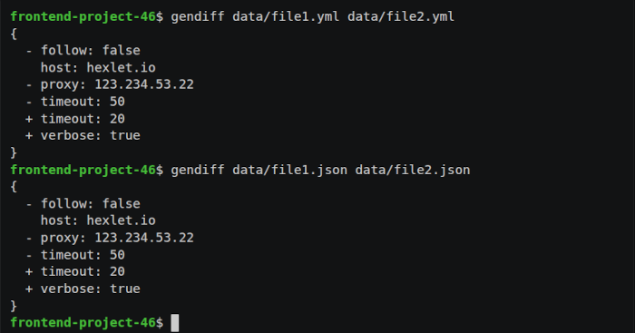
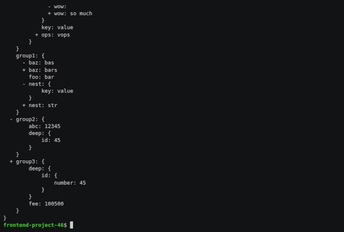
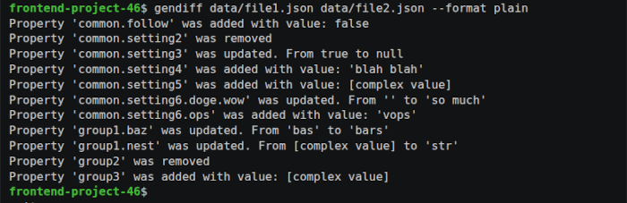
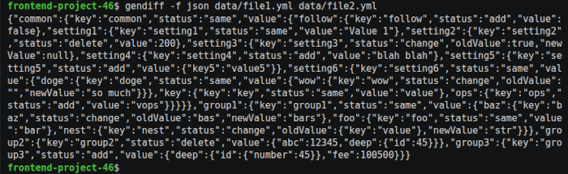

### Проект Hexlet "Вычислитель отличий"

Консольная программа для рекурсивного сравнения json и yaml файлов.

### Минимальные системные требования
- node - 20.15+
- npm - 10.8+

### Установка
Скопируйте репозиторий на компьютер:
```bash
git clone git@github.com:Chuvikovsky/difference-calculator.git
```

Перейдите в папку `difference-calculator`
```bash
cd difference-calculator
```

Установите необходимые зависимости:
```
make install
```

### Запуск программы
Программу можно запустить находясь в папке `difference-calculator` по команде:
```bash
make gendiff <PATH_TO_FILE_1> <PATH_TO_FILE_2>
```
Программу также можно поставить глобально. Для этого нужно находясь в папке `difference-calculator` ввести следующие команды:
```bash
make publish
npm link
```
После глобальной установки программа запускается в терминале:
```bash
gendiff <PATH_TO_FILE_1> <PATH_TO_FILE_2>
```

### Справка программы
```bash
$ gendiff -h
Usage: gendiff [options] <file1> <file2>

Compares two configuration files and shows a difference.

Arguments:
  file1                first file to compare
  file2                second file to compare

Options:
  -V, --version        output the version number
  -f, --format <type>  output format (default: "stylish")
  -h, --help           display help for command

```

### Пример использования:

```bash
# формат plain
gendiff --format plain path/to/file.yml another/path/file.json

Property 'common.follow' was added with value: false
Property 'group1.baz' was updated. From 'bas' to 'bars'
Property 'group2' was removed

# формат stylish
gendiff filepath1.json filepath2.json

{
  + follow: false
    setting1: Value 1
  - setting2: 200
  - setting3: true
  + setting3: {
        key: value
    }
  + setting4: blah blah
  + setting5: {
        key5: value5
    }
}
```


[asciinema with flat json file](https://asciinema.org/a/N4hVylGldcCTFWzpTz4PwQaTg)

[asciinema with flat yaml file](https://asciinema.org/a/2qFqMQeVcFDSLUUcd4XUc5J2F)



[asciinema with nested files](https://asciinema.org/a/7oyT9lyhfe2YXqcupEE0ngGCP)



[asciinema with plain format](https://asciinema.org/a/YUEUfArvDkv3c2f3FnGJ8eJVl)



[asciinema with json format](https://asciinema.org/a/kcEbzSyhEZQxZGSTMBxltPM73)

